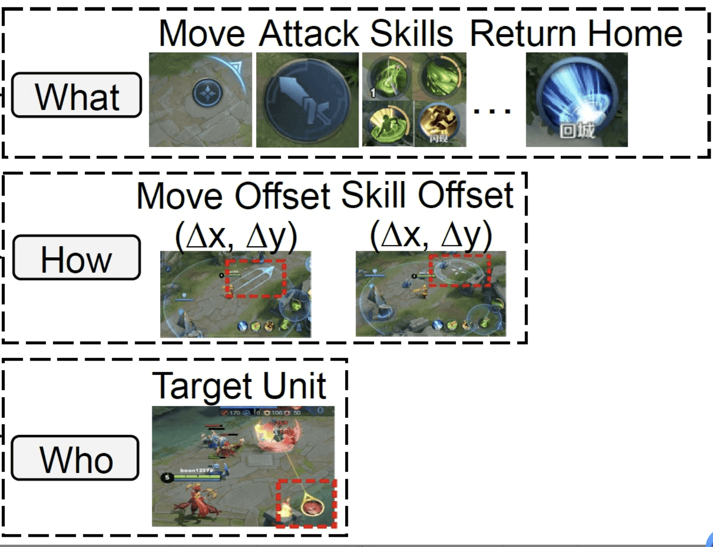
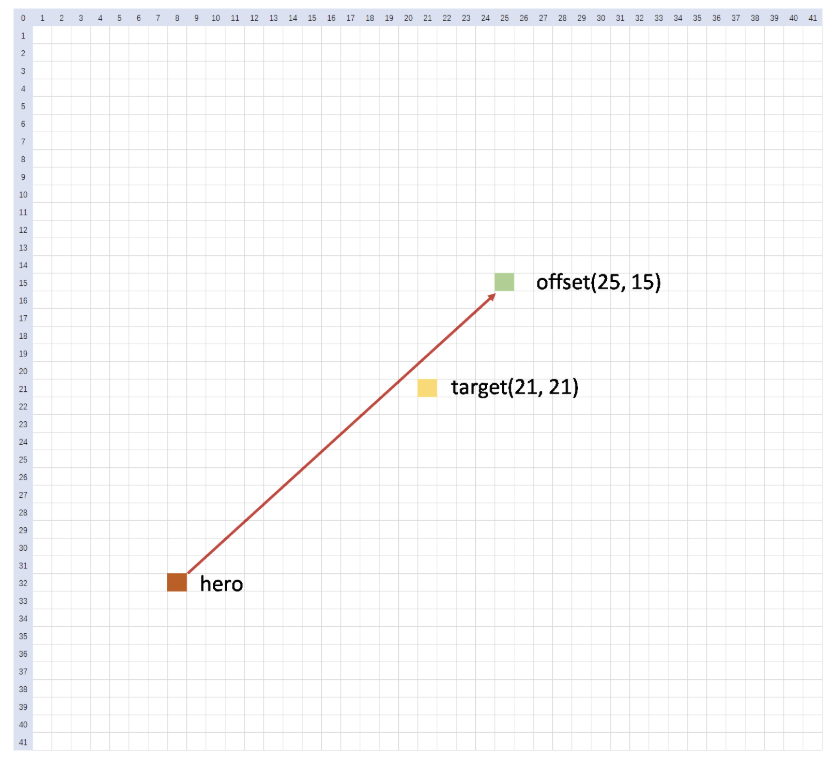
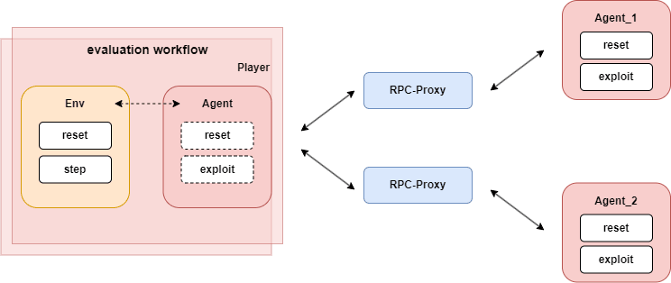
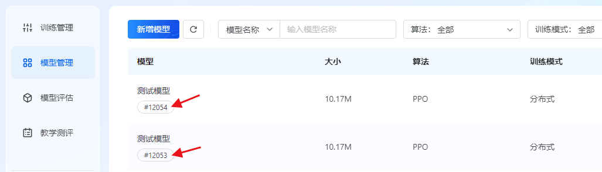

# 环境详述

## 环境配置

在智能体和环境的交互中，首先会调用 `env.reset`方法，该方法接受一个 `usr_conf`参数，这个参数通过读取 `agent_算法名/conf/train_env_conf.toml`文件的内容来实现定制化的环境配置。因此，用户可以通过修改 `train_env_conf.toml`文件中的内容来调整环境配置。

```python
# 读取 train_env_conf.toml 得到 usr_conf，此处以 agent_ppo 为例
usr_conf = read_usr_conf("agent_ppo/conf/train_env_conf.toml", logger)

# env.reset 返回一个 dict：{observation, extra_info, ...}
env_obs = env.reset(usr_conf=usr_conf)
observation = env_obs["observation"]
extra_info = env_obs["extra_info"]
```

`train_env_conf.toml`中包含以下信息：

|               数据名               | 数据类型 |              取值范围              |  默认值  | 数据描述                                                                                |
| :--------------------------------: | :------: | :---------------------------------: | :-------: | --------------------------------------------------------------------------------------- |
|       **monitor_side**       |   int   |               [0, 1]               |     0     | 监控上报的阵营，0 表示蓝方阵营，1 表示红方阵营                                          |
| **auto_switch_monitor_side** |   bool   |             true/false             |   true   | 是否启用自动换边逻辑                                                                    |
|      **opponent_agent**      |  string  | selfplay / common_ai / 自定义模型id | selfplay | 对手智能体类型。selfplay：自对弈；common_ai：与规则AI对战；自定义模型id：与指定模型对战 |
|      **eval_interval**      |   int   |                 >=1                 |    10    | 评估间隔（单位：局）                                                                    |
|    **eval_opponent_type**    |  string  | selfplay / common_ai / 自定义模型id | common_ai | 评估对手类型                                                                            |
|     **hero_id（蓝方）**     |   int   |              112 / 133              |    112    | 蓝方英雄ID：112=鲁班七号，133=狄仁杰                                                    |
|     **hero_id（红方）**     |   int   |              112 / 133              |    112    | 红方英雄ID：112=鲁班七号，133=狄仁杰                                                    |

具体使用方式请参考下方提供的默认示例

```yaml
[monitor]
# 监控上报的阵营，类型整型，取值范围[0,1]
# 0表示蓝方阵营，1表示红方阵营
monitor_side = 0  

# Auto switch monitor side, Type: boolean, value range: [true, false]
# 是否启用自动换边逻辑，类型布尔值，true表示开启，false表示关闭
auto_switch_monitor_side = true

[episode]
# 对手智能体，类型字符串，取值范围[selfplay, common_ai, 自定义模型id]
# 1. selfplay：自对弈
# 2. common_ai：与基于规则的common_ai对战
# 3. 自定义的模型id：与指定的模型对战，需要先将模型上传至模型管理，并且将模型ID配置在kaiwu.json中，然后在此处进行引用
opponent_agent = "selfplay"

# 评估间隔(单位局)，类型整型，取值范围为大于等于1的整数
eval_interval = 10

# 评估对手类型，类型字符串，取值范围为[selfplay, common_ai, 自定义模型id]
# 值的含义请参考opponent_agent注释
eval_opponent_type = "common_ai"

# 蓝方阵容配置
[[lineups.blue_camp]]
# 英雄ID，类型整数，取值范围: 112:鲁班七号，133:狄仁杰
hero_id = 112

# 红方阵容配置
[[lineups.red_camp]]
# 英雄ID，类型整数，取值范围: 112:鲁班七号，133:狄仁杰
hero_id = 112
```

> **💡 补充说明** ：
>
> 1. **`train_env_conf.toml`文件中的配置仅在训练时生效** ，请按上表数据描述进行配置。若配置错误，训练任务会变为“失败”状态，此时可以通过查看**env模块的错误日志**进行排查。
> 2. 若需调整模型评估任务时的配置，用户需要通过腾讯开悟平台创建评估任务并完成环境配置，详细参数见[智能体模型评估模式](https://tencentarena.com/docs/p-competition-hok1v1/61.1.3/guidebook/dev-guide/agent_competition/#%E6%A8%A1%E5%9E%8B%E8%AF%84%E4%BC%B0%E6%A8%A1%E5%BC%8F)。

## 环境信息

调用 `env.step`接口时，会返回 `(env_reward, env_obs)` 两个 dict：

```python
env_reward, env_obs = env.step(actions)
```

* `env_reward`：训练侧回报数据（非比赛分数）
* `env_obs`：环境观测数据，结构如下表：

|   数据名   |  数据类型  |             数据描述             |
| :---------: | :---------: | :------------------------------: |
|  frame_no  |    int32    |     当前环境实例运行时的帧数     |
| observation | Observation | 环境实例针对智能体提供的观测信息 |
| terminated |    int32    |       当前环境实例是否结束       |
|  truncated  |    int32    |    当前环境实例是否异常或中断    |
| extra_info |  ExtraInfo  |      环境实例的可选额外信息      |

调用 `env.reset`可以重置环境，此时，只返回 env_obs。

下面会对这些数据进行介绍，完整的观测数据结构可以参考[数据协议](https://tencentarena.com/docs/p-competition-hok1v1/61.1.3/guidebook/dev-guide/protocol/).

### 观测信息（observation）

`observation`是环境实例针对智能体返回的原始信息，按照阵营进行区分。`observation[agent_id]`对应的具体描述如下：

|     数据名     |                         数据描述                         |
| :-------------: | :-------------------------------------------------------: |
|     env_id     |                          对局id                          |
|    player_id    |             英雄运行时id, 作为英雄的唯一标识             |
|   player_camp   |                       英雄所属阵营                       |
|  legal_action  |                         合法动作                         |
| sub_action_mask | 不同动作（button）对应的合法子动作（move、skill、target） |
|   frame_state   |                        环境帧状态                        |
|       win       |                         是否获胜                         |

#### 环境帧状态（frame_state）

|    数据名    |                        数据描述                        |
| :----------: | :-----------------------------------------------------: |
|   frame_no   |                        当前帧号                        |
| hero_states |             当前帧中所有英雄状态构成的集合             |
|  npc_states  | 当前帧中所有 NPC 状态构成的集合（小兵、防御塔、野怪等） |
|   bullets   |             当前帧中所有子弹状态构成的集合             |
|    cakes    |          当前帧中所有功能物件（神符等）的集合          |
| frame_action |          本帧发生的事件（目前仅包含死亡事件）          |
|  map_state  |               地图状态（1v1 默认不使用）               |

完整字段结构见[数据协议](https://tencentarena.com/docs/p-competition-hok1v1/61.1.3/guidebook/dev-guide/protocol/#aiframestate--%E5%B8%A7%E7%8A%B6%E6%80%81)。

### 额外信息（extra_info）

环境会提供部分额外信息，训练时作为提供给智能体的观测信息的补充，评估时无法获取。在本环境中，额外信息仅包含了环境的错误码和错误信息，因此不会在训练和评估时传输给智能体使用。

### 动作空间

王者1v1强化项目使用层次化的动作空间，将所有动作分为以下几类：

* what，你要按哪个按键：**12个button**
* how，你要往哪个方向拖动按键：**16*16个方向选择**
* who，你的技能作用对象是谁：**9个target（None，敌方英雄，自身英雄，防御塔，4个小兵，1个野怪）**

[动作空间示意图](https://tencentarena.com/docs/p-competition-hok1v1/61.1.3/assets/images/image55-5d92ea0af32f2e8713dcdf9443fceaef.png)



#### 动作空间各维度说明

| Action Class    | Type                          | Description   | Dimension |
| --------------- | ----------------------------- | ------------- | --------- |
| Button          | None                          | 非法动作      | 1         |
| None            | 无动作                        | 1             |           |
| Move            | 移动                          | 1             |           |
| Normal Attack   | 释放普通攻击                  | 1             |           |
| Skill 1         | 释放第1个技能                 | 1             |           |
| Skill 2         | 释放第2个技能                 | 1             |           |
| Skill 3         | 释放第3个技能                 | 1             |           |
| Heal Skill      | 释放恢复技能                  | 1             |           |
| Chosen Skill    | 释放召唤师技能                | 1             |           |
| Recall          | 释放回城技能                  | 1             |           |
| Skill 4         | 释放第4个技能(仅特定英雄有效) | 1             |           |
| Equipment Skill | 释放特定装备提供的技能        | 1             |           |
| Move            | Move X                        | 沿X轴移动方向 | 16        |
| Move Z          | 沿Z轴移动方向                 | 16            |           |
| Skill           | Skill X                       | 技能沿X轴方向 | 16        |
| Skill Z         | 技能沿Z轴方向                 | 16            |           |
| Target          | None                          | 空目标        | 1         |
| Enemy           | 敌方英雄                      | 1             |           |
| Self            | 自身英雄                      | 1             |           |
| Soldier         | 最近的四个小兵                | 4             |           |
| Tower           | 最近的防御塔                  | 1             |           |
| Monster         | 最近的野怪                    | 1             |           |

#### Action Mask 机制

 **Sub action mask** （对应 `observation[agent_id]["sub_action_mask"]`）：

该机制根据当前按钮（button）类型，对剩余动作（action）进行选择性过滤。

 **原因** ：并非所有技能都需要拖动按键，也并非所有技能都有目标（target）。

举例说明：

* 以貂蝉为例，其1技能和2技能是方向性技能，因此当预测按钮为 `skill1` 或 `skill2` 时，`skill X` 与 `skill Z` 的预测结果是有意义的。
* 而对于貂蝉的3技能，`skill X` 与 `skill Z` 的预测结果则没有意义，应予以过滤。

[Sub action mask](https://tencentarena.com/docs/p-competition-hok1v1/61.1.3/assets/images/image56-e87ef863e282250a84c434796af6eef1.gif)

**Legal action mask** (对应 `observation[agent_id]["legal_action"]`):

* 根据游戏规则，直接屏蔽不合法或不可执行的动作预测。例如：处于冷却状态（CD）中的技能无法释放，因此对应动作会被屏蔽。该机制能够加快训练速度，避免模型进行无意义的动作探索，提高训练效率。

[Legal action mask](https://tencentarena.com/docs/p-competition-hok1v1/61.1.3/assets/images/image57-c39c1607cfb98f031ca69c02e73307e8.gif)

#### **action具体的执行流程**

AI选取action的流程如下：

1. 选择执行的动作类型（which_button） 从 `which_button`维度中，选取值最大的索引对应的合法动作（legal action），作为英雄下一步要执行的动作。
2. 根据所选动作类型，确定动作参数的计算方式：

动作参数的计算根据技能类型分为以下几类：

1. 方向型技能：需要读取位置偏置 `offset_x`, `offset_z`和 `target`
2. 位置型技能：需要读取位置偏置 `offset_x`, `offset_z`和 `target`
3. 目标性技能：只需读取target

**示例：[方向型技能的执行过程](https://tencentarena.com/docs/p-competition-hok1v1/61.1.3/assets/images/offset_x_z-ae5df19862180b0ceb83e579cd76dcd9.png)**



* 橙色方块为main_hero的位置，黄色方块为选中的target的位置。
* 我们以target位置作为offset坐标系的中心点，因此它在offset维度对应的索引为(21, 21)。
* 然后，我们根据offset_x，offset_z的找到最终的位置（下例中以offset_x=25,offset_z=15为例），图中绿色即为以黄色点为中心，offset为(25, 15)的最终目标位置。
* 那么连接橙色的英雄位置和绿色方块位置的红色箭头方向即为实际技能释放方向。

**备注：**

* 这里如果直接把 `(skill_x, skill_z)` 设置成 `(21, 21)`, 技能的释放方向就是目标所在的位置
* 这里图示例子的 `offset_x`和 `offset_z`是 42 * 42 的, **在1v1的环境中, 应该是 16 * 16**
* `move_x`和 `move_z`同理, 当action为move的时候, 以自身为 `target`

### 观测视野范围

环境存在战争迷雾机制，智能体只能观测到属于己方阵营的单位，或者处于己方阵营单位视野范围内的敌方单位和建筑。视野范围由单位的视野半径决定，超出视野范围的敌方单位和建筑将不可见。

### 时间信息

帧(frame)和步(step)存在一定映射关系。

**帧**是场景的一个时间单位，表示场景的一个完整更新周期。在每一帧中，场景的所有元素(如英雄状态等)都会根据当前的状态和输入进行更新。

**步**是强化学习环境中的一个时间单位，表示智能体(agent)在环境中执行一个动作并接收反馈的过程。在每一步中，智能体选择一个动作，环境根据该动作更新状态，并返回新的状态、奖励和终止信号。

在本环境中，1 个 step 由 6 个 frame 组成。这意味着每个动作对应一个步，在每一步中，智能体将在六个连续的帧中执行同一个动作。环境将在每一步结束后更新状态并返回反馈，场景只有在完成六帧后，环境状态才会返回一次状态的更新。

* **步更新** ：在每一步中，智能体选择一个动作，环境更新状态并返回。
* **帧更新** ：在一步中，场景进行六次帧更新，更新所有场景中对象的状态并渲染新的画面。

帧(frame)，步(step)，仿真时间秒(s)和仿真时间毫秒(ms)的关系如下：

1 frame 约等于 33 ms

1 step 执行 6 frame

1 s 等于 1000 ms

## 环境监控信息

监控面板中包含了**env**模块，表示**环境指标**数据。王者荣耀1v1 分为 **self-play** 和 **eval** 两种模式的监控指标，详细说明如下。

### self-play 指标

| 面板中文名称 |  面板英文名称  |            指标名称            |                                       说明                                       |
| :----------: | :-------------: | :----------------------------: | :------------------------------------------------------------------------------: |
|     胜率     |    win_rate    |            win_rate            |   每局任务结束时，在 monitor_side 视角下获得任务胜利即为1，失败为0，超时为0.5   |
|  防御塔血量  |    tower_hp    | self_tower_hp / enemy_tower_hp |        每局任务结束时，两边阵营防御塔剩余的血量，可以反映智能体的推塔能力        |
|  任务总帧数  |      frame      |             frame             |                         每局任务结束时，该局任务的总帧数                         |
|     经济     | money_per_frame |        money_per_frame        |       每局任务结束时，在 monitor_side 视角获得 money 的总量除以对局总帧数       |
| 击杀/死亡数 |       K/D       |          kill / death          |    kill：单局内我方英雄击杀敌方英雄的计数；death：单局内我方英雄被击杀的计数    |
|     伤害     | hurt_per_frame |  hurt_by_hero / hurt_to_hero  | hurt_by_hero：每帧受到来自敌方英雄的伤害；hurt_to_hero：每帧对敌方英雄造成的伤害 |

### eval 指标

与 self-play 指标相同，通过 label 区分对手类型，例如 `win_rate:common_ai`、`win_rate:{model_id}`。

---

# 智能体详述

我们在代码包中提供了智能体的简单实现，本文将对该部分内容进行讲解，包括观测处理及优化指南等。

## 观测处理

环境返回的 `observation`信息包含了针对智能体的局部观测信息，可以在 `observation_process`函数中对这些局部观测信息进行处理。

很多情况下，观测信息体量较大且步骤繁多，我们推荐用户基于代码包提供的 `process_feature`进行特征处理：

```python
defprocess_feature(self, observation):
    frame_state = observation["frame_state"]

    main_camp_hero_vector_feature = self.process_hero_feature(frame_state)
    organ_feature = self.process_organ_feature(frame_state)

    feature = main_camp_hero_vector_feature + organ_feature

return feature
```

### 特征处理

通过在程序中调用 `env.reset`或 `env.step`，环境会返回当前帧的环境状态数据，从中可以获取到英雄血量、技能信息、防御塔信息等数值，基于游戏状态数据，可以处理得到智能体网络推理所需的特征。

以下是特征区间及其维度的详细说明：

|     **特征区间名**     | **特征维数** | **举例**       |
| :---------------------------: | :----------------: | -------------------- |
| main_camp_hero_vector_feature |         3         | 英雄存活情况、位置   |
|         organ_feature         |         7         | 敌方防御塔血量、位置 |

代码包中提供了一些特征的实现，可以参考 `<agent_算法名称>/feature/feature_process/__init__.py`目录下里的 `FeatureProcess`类的设计和实现。`FeatureProcess` 类内部包含了 `HeroProcess`，`OrganProcess`等子类，分别用于处理不同单位的特征。

处理特征时，首先会根据当前观测的环境帧数据来保存各个单位的信息，然后从 `feature_config`特征配置中读取对应的**特征处理函数**和 **特征归一化配置** ：

* **特征处理函数** ：用于从帧数据中提取特征。
* **特征归一化配置** ：通过 one-hot 编码或最大最小值归一化方法，将特征归一化到 0～1 的范围，以便于网络推理计算。

需要注意的是：

* 对于位置特征：考虑到王者1v1中地图相对于游戏双方而言是镜像对称的，在双方眼中其都处于地图左下角，故使用相对位置特征，将处于地图右上角的英雄的特征数据进行镜像反转，将其转换为左下角位置。

### 奖励处理

这里的奖励特指强化学习中的Reward，注意要与环境反馈的Score进行区分。Score用于衡量玩家在任务中的表现，也作为衡量强化学习训练后的模型的优劣。

代码包里提供了一些奖励的实现，可以参考 `<agent_算法名称>/feature/reward_process.py`里的 `GameRewardManager`类的设计和实现，用户还可以在这个函数中去实现自己的reward设计，这部分非常开放，回报设计的依据不一定只是环境给出的信息，也可以是用户对问题的理解、经验或者知识，建议用户根据对问题和强化学习算法的理解，去设计和实现自己的reward。

参考代码包中GameRewardManager对reward的实现，同学们可以通过设计多个奖励子项来帮助智能体获得更好的效果。以下是推荐设计的奖励子项：

| **reward** | **存储类型** | **描述**   |
| ---------------- | ------------------ | ---------------- |
| hp_point         | dense              | 英雄生命值比例   |
| tower_hp_point   | dense              | 防御塔生命值比例 |
| money (gold)     | dense              | 获得的总金币数   |
| ep_rate          | dense              | 法力值比例       |
| death            | sparse             | 英雄被击杀       |
| kill             | sparse             | 击杀敌方英雄     |
| exp              | dense              | 获得的经验值     |
| last_hit         | sparse             | 对小兵的最后一击 |
| forward          | dense              | 前进奖励         |

其中，`tower_hp_point` 和 `forward` 奖励已在默认代码中实现，大家可以参考其设计思路进行扩展。

#### 回报计算方法

* 部分奖励使用零和reward设计方案，以当前决策帧和上一决策帧的相关数值差作为agent的reward，两个agent的同类reward项相减作为最终reward，最终多种reward项加权求和作为最终的reward返回。回报计算方法不止一种，我们鼓励用户进行创新。

### 召唤师技能选择

智能体在 **对局初始化阶段** ，需根据双方英雄信息自主选择一个召唤师技能，选择发生在 `env.reset()` 之前。

### 选择流程

```python
usr_conf = load_usrconf()

for camp in camps:
    summoner_skill_id = agents[camp].init_config(lineups)
    usr_conf[camp]["summoner_skill_id"]= summoner_skill_id

# 对局初始化
env_obs = env.reset(usr_conf)
for camp in camps:
    act = agents[camp].reset(env_obs)

# 常规对战循环
whilenot done:
    action =[]
for camp in camps:
        act = agents[camp].exploit(env_obs)
        action.append(act)
    env_reward, env_obs = env.step(action)
```

### init_config 接口

Agent 新增 `init_config()` 方法，用于在初始化阶段选择召唤师技能：

```python
definit_config(self, lineups)->dict:
"""
    在对局初始化阶段选择召唤师技能。

    Args:
        lineups: 双方英雄ID

    Returns:
        int: summoner_skill_id
    """
```

### 召唤师技能列表

| 技能名称 | 技能ID | 效果描述                                         |
| :------: | :----: | ------------------------------------------------ |
|  治疗术  | 80102 | 立即恢复英雄一定量的生命值                       |
|   晕眩   | 80103 | 对身边所有敌人施加眩晕效果，使其短暂无法行动     |
|   惩击   | 80104 | 对身边的野怪和小兵造成真实伤害并眩晕             |
|   干扰   | 80105 | 沉默敌方机关使用，使其短暂无法进行攻击           |
|   净化   | 80107 | 解除自身所有负面和控制效果并暂时免疫控制效果     |
|   终结   | 80108 | 对低血量敌方英雄造成基于其已损失生命值的真实伤害 |
|   疾跑   | 80109 | 短时间内大幅提升英雄移动速度                     |
|   狂暴   | 80110 | 短时间内提升英雄物理吸血和法术吸血               |
|   闪现   | 80115 | 向指定方向位移一段距离                           |
|   弱化   | 80121 | 减少身边敌人伤害输出                             |

---

## 算法介绍

我们在王者1v1代码包中提供了1个核心算法  **PPO** ，同时，我们还提供了一个**diy**模板算法文件夹，用户可在该文件夹中自定义算法实现。

### PPO 算法

PPO算法，是一种通过截断策略更新幅度平衡训练效率与稳定性的强化学习算法，核心思想是“小步多次更新，避免策略崩溃”。

## 算法监控信息

|        指标名称        | 说明                                                                   |
| :--------------------: | ---------------------------------------------------------------------- |
|    **reward**    | 对局的累积回报，反应了智能体的能力，正常训练情况下指标应该是震荡向上。 |
|  **total_loss**  | 算法计算的所有loss总和。                                               |
|  **value_loss**  | 算法计算的值函数的loss。                                               |
| **policy_loss** | 算法计算的决策动作概率的loss。                                         |
| **entropy_loss** | 策略的概率分布计算得到的熵loss。                                       |

## 模型保存限制策略

为了避免用户保存模型的频率过于频繁，开悟平台对模型保存会有安全限制，不同的任务会有不同的限制，限制规则详情如下：

* 保存模型的频率限制: 2次/分钟
* 单个任务保存模型的次数限制：400次

## 模型评估模式

评估时用户需要在提交任务界面进行配置，包括选择的对手模型、评估局数。另外，训练模式时，用户一般使用 `agent.predict`方法进行决策；而在评估模式时，平台会调用 `agent.exploit`方法进行决策，一般情况下，模型在训练和评估时的决策会因算法不同和用户设计不同，而有不同的行为，这部分由用户定义和实现。

评估时将会分别启动两个智能体容器作为AI服务，这个服务只有两个接口即 `agent.reset`和 `agent.exploit`，`agent.reset`的输入为环境 `env.reset`返回的 `observation`，仅在每局环境reset时调用一次；`agent.exploit`的输入即环境 `env.step`返回的 `observation`，输出作为环境下一个 `env.step`的输入，评估的workflow会分别调用两个智能体的agent.exploit方法进行对战，最后根据智能体胜负情况进行模型能力的判定。以上过程可以描述为下图：

[评估任务描述](https://tencentarena.com/docs/p-competition-hok1v1/61.1.3/assets/images/eval_two_agent_add_reset-6868504feb46d09500c98e3d01b630e5.png)



## 训练中评估模式

我们支持在训练过程中以一定的局数间隔与common_ai或用户指定的对手模型进行对战评估，以反映当前训练模型对对战水平的提升。 用户需要在usr_conf中设置 `monitor_side`作为被评估对象，另一个智能体作为评估的对手，训练时评估的数据将会在监控中展示。

评估时的对手模型可以选择以下两种：

1. common_ai：这是内置在环境中的一个由规则实现的 AI，其能力是固定的。
2. 用户自定义模型：用户可以将期望用作对手模型的模型 ID 配置在 kaiwu.json 中（模型 ID 可以在平台的模型管理中查看）,通过 `agent.load_opponent_agent()`加载期望的模型。我们最多支持配置 3 个模型，但在一次训练中，建议只选择其中一个模型作为评估的对手。

以下是kaiwu.json的配置示例：

```json
{
"model_pool":[12053,12054]
}
```

下图是开悟平台模型管理的截图，我们可以将模型id写入kaiwu.json用于训练时的评估。

[评估模型列表](https://tencentarena.com/docs/p-competition-hok1v1/61.1.3/assets/images/model_list_new-be5ac74c35b365f3a578c2013b13f6a6.png)



> **注意** ：如果选择使用对手模型，那对手模型只能是当前兼容版本的模型，如果版本存在变更导致不兼容性问题，强行使用会导致 `加载模型失败`的报错。
