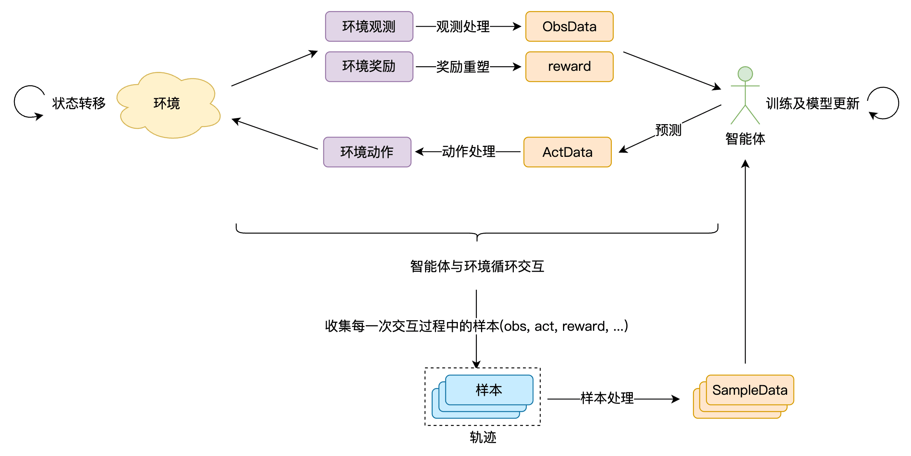

# 综述

> 欢迎来到腾讯开悟！

腾讯开悟强化学习开发框架是基于[强化学习系统系列技术标准](https://tencentarena.com/docs/p-competition-hok1v1/61.1.3/guidebook/taa-rl-fw/rl_standard/)打造的标准化开发套件。该框架为开发者提供了标准化的编程接口和丰富的工具集，支持开发者高效完成智能体开发、环境交互，以及模型的训练及预测流程。

## 训练流程简介

本开发框架的完整训练流程如下图所示：

[开发任务描述](https://tencentarena.com/docs/p-competition-hok1v1/61.1.3/assets/images/agent_train-1f803e4ac789e0c23f0e3d6349b73370.png)



如图，完整训练流程包含以下关键环节：

|             环节             | 介绍                                                                                                                                                                                                                                                                                         |
| :---------------------------: | -------------------------------------------------------------------------------------------------------------------------------------------------------------------------------------------------------------------------------------------------------------------------------------------- |
| **智能体-环境循环交互** | - 智能体将环境提供的观测和奖励处理为符合预测函数输入要求的数据；``- 调用预测函数，生成动作指令；``- 将智能体输出的动作指令处理为符合环境输入要求的数据；``- 环境执行动作后完成状态转移，并反馈新的观测数据和奖励数据；                                                  |
|      **样本处理**      | - 每个环境有不同的开始与结束逻辑，智能体与环境从开始到结束的完整交互过程，称为episode；``- 智能体与环境每一次交互产生的结构化数据，称为 **样本** ；一个episode产生的样本序列称为 **轨迹** ；``- 对轨迹数据进行处理，转换为规范化 **训练样本(SampleData)** ； |
|    **模型迭代优化**    | - 基于训练样本，通过算法持续更新模型参数，实现策略优化；                                                                                                                                                                                                                                     |
|   **智能体模型更新**   | - 智能体加载最新模型，与环境继续循环交互；                                                                                                                                                                                                                                                   |

该流程通过强化学习分布式计算框架提供的训练工作流实现。基于此，开发框架主要包含三大核心模块：

* [强化学习环境系统](https://tencentarena.com/docs/p-competition-hok1v1/61.1.3/guidebook/taa-rl-fw/rl_env/)：提供标准的 **强化学习环境接口** 。开发者可以通过标准接口，实现智能体与环境的交互。
* [强化学习智能体开发套件](https://tencentarena.com/docs/p-competition-hok1v1/61.1.3/guidebook/taa-rl-fw/rl_agent/info/)：提供标准的 **强化学习智能体接口** ，以及算法库、模型组件库等工具函数库。开发者可以通过工具函数库快速完成智能体的构建。
* [强化学习分布式计算框架](https://tencentarena.com/docs/p-competition-hok1v1/61.1.3/guidebook/taa-rl-fw/distributed_computing_fw/)：提供标准接口，支持开发者按需实现训练工作流，运行单机或分布式的训练及评估任务。

## 代码包简介

开发者可以通过腾讯开悟平台所提供的强化学习项目使用开发框架。一个强化学习项目的代码目录如下：

```text
📦 根目录
├── 📂 agent
│   ├── 📂 algorithm
│       └── 📄 __init__.py
│       └── 📄 algorithm.py
│   ├── 📂 conf
│       └── 📄 __init__.py
│       └── 📄 conf.py
│       └── 📄 train_env_conf.toml
│   ├── 📂 feature
│       └── 📄 __init__.py
│       └── 📄 definition.py
│       └── 📄 preprocessor.py
│   ├── 📂 model
│       └── 📄 __init__.py
│       └── 📄 model.py
│   ├── 📂 workflow
│       └── 📄 __init__.py
│       └── 📄 train_workflow.py
│   ├── 📄 __init__.py
│   └── 📄 agent.py
├── 📂 conf
│   ├── 📄 __init__.py
│   ├── 📄 configure_app.toml
├── 📂 log
└── 📄 train_test.py
```

代码目录介绍：

|         目录名         | 介绍                                                                                                           |
| :---------------------: | -------------------------------------------------------------------------------------------------------------- |
|    **agent/**    | 智能体子目录，智能体相关内容均集中于该目录，是开发者核心工作目录。                                             |
|     **conf/**     | 配置文件目录，包含运行训练任务相关的配置，例如训练样本批处理大小batch_size等。                                 |
|     **log/**     | 日志目录，存放运行代码测试脚本时生成的日志文件。                                                               |
| **train_test.py** | 代码正确性测试脚本，该脚本会使用当前代码包完成一步训练。建议开发者在启动训练任务前，确保代码已通过该脚本检测。 |

### agent

|     目录/文件名     | 介绍                                                                                                                                                                                                       |
| :------------------: | ---------------------------------------------------------------------------------------------------------------------------------------------------------------------------------------------------------- |
| **algorithm/** | 算法相关，开发者在该目录下完成算法实现，包含loss计算、模型优化等，详情见[算法开发](https://tencentarena.com/docs/p-competition-hok1v1/61.1.3/guidebook/taa-rl-fw/rl_agent/algorithm/)                         |
|  **feature/**  | 特征相关，开发者在该目录下完成数据结构定义和数据处理方法，以及样本处理和奖励计算，详情见[数据处理与奖励设计](https://tencentarena.com/docs/p-competition-hok1v1/61.1.3/guidebook/taa-rl-fw/rl_agent/feature/) |
|   **model/**   | 模型相关，开发者在该目录下完成模型实现。 详情见[模型开发](https://tencentarena.com/docs/p-competition-hok1v1/61.1.3/guidebook/taa-rl-fw/rl_agent/model/)                                                      |
| **workflow/** | 工作流目录，开发者在该目录下完成训练工作流的开发。 详情见[工作流开发](https://tencentarena.com/docs/p-competition-hok1v1/61.1.3/guidebook/taa-rl-fw/rl_agent/workflow/)                                       |
|  **agent.py**  | 智能体核心代码文件，开发者在该文件中完成预测、训练等核心函数的实现。 详情见[智能体开发](https://tencentarena.com/docs/p-competition-hok1v1/61.1.3/guidebook/taa-rl-fw/rl_agent/agent/)                        |

标准代码包中都存在一个agent_diy子文件夹，该文件夹是预定义的智能体模板，可供开发者进行智能体的开发。

### conf

|            文件名            | 介绍                                             |
| :--------------------------: | ------------------------------------------------ |
| **configure_app.toml** | 训练任务相关的配置，包括样本大小、样本池大小等。 |

---

通过对训练流程和代码包的介绍，相信开发者能够对腾讯开悟开发框架建立了初步认知。

接下来，我们将详细介绍每个模块的功能及使用方式。

---

# 环境

在综述中提到，强化学习训练流程离不开智能体与环境的持续交互，本文将详细介绍强化学习环境系统的功能及标准接口函数。

## 概述

强化学习环境是基于输入动作，输出观测、奖励等反馈的功能模块，用于表达强化学习算法所求解的问题场景。

开发框架通过场景适配模块，对仿真器进行封装，将其特化的接口、协议转换为强化学习环境统一的接口和协议，供智能体调用。

强化学习环境系统主要提供如下功能：

1. 接收配置信息，用于指定自身初始化方式，比如环境中各种元素的初始状态。
2. 输出观测、奖励信息，可用于智能体预测、训练。
3. 输出观测、奖励之外的其他信息，供强化学习系统相关组件使用以实现特定功能。其他信息可包括可视化数据、日志数据等，实现的功能包括环境可视化、运行状况监测等。
4. 接收动作指令，完成状态转移并产生新的观测和奖励。

---

## 环境使用

开发框架通过场景适配模块，将问题场景进行标准化封装，为开发者提供统一的交互接口与通信协议。由于环境之间存在差异，接口中所涉及的观测、奖励等信息的具体数据结构也有所不同，开发者需查阅所使用环境的官方数据协议文档以获取准确信息。

开发者可以在[训练工作流](https://tencentarena.com/docs/p-competition-hok1v1/61.1.3/guidebook/taa-rl-fw/distributed_computing_fw/#%E8%AE%AD%E7%BB%83%E5%B7%A5%E4%BD%9C%E6%B5%81)的workflow中获取到对应环境的实例，通过标准接口实现智能体与环境的交互。

**核心函数介绍**

### reset(usr_conf)

reset会将环境重置为环境配置文件中指定的状态，并且返回初始观测。

```python
# usr_conf为开发者传入的环境配置
obs, state = env.reset(usr_conf = usr_conf)
```

**Parameters**

|       参数名       | 介绍                   |
| :----------------: | ---------------------- |
| **usr_conf** | dict类型，环境配置文件 |

**Returns**

|     参数名     | 介绍                   |
| :-------------: | ---------------------- |
|  **obs**  | dict类型，环境观测信息 |
| **state** | dict类型，环境全局信息 |

---

### step(act, stop_game = false)

环境会执行传入的act动作指令，完成一次状态转移，并返回新的观测和奖励等信息。

```python
frame_no, _obs, score, terminated, truncated, _state = env.step(act, stop_game = false)
```

**Parameters**

|       参数名       | 介绍                       |
| :-----------------: | -------------------------- |
|    **act**    | dict类型，环境执行的动作   |
| **stop_game** | bool类型，是否结束当前对局 |

**Returns**

|        参数名        | 介绍                                 |
| :------------------: | ------------------------------------ |
|  **frame_no**  | int类型，当前环境实例运行时的帧号    |
|    **_obs**    | dict字典类型，当前帧的观测信息       |
|   **score**   | int类型，当前帧的奖励信息            |
| **terminated** | bool类型，当前环境实例是否结束       |
| **truncated** | bool类型，当前环境实例是否异常或中断 |
|   **_state**   | dict字典类型，当前帧的全部状态信息   |

---
