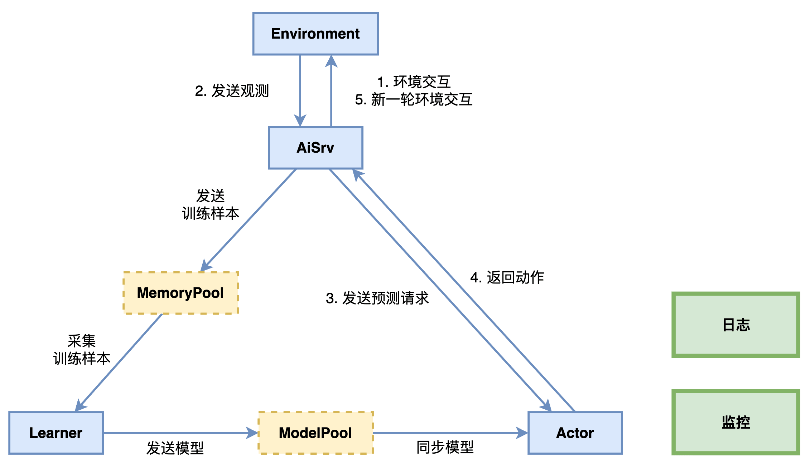

# 综述

智能体是强化学习系统中的核心模块，在[开发框架综述](https://tencentarena.com/docs/p-competition-hok1v1/61.1.3/guidebook/taa-rl-fw/intro/)中提到，完整训练流程包括：

|             环节             | 介绍                                                                                                                                                                                                                                                               |
| :---------------------------: | ------------------------------------------------------------------------------------------------------------------------------------------------------------------------------------------------------------------------------------------------------------------ |
| **智能体-环境循环交互** | - 智能体将环境提供的观测和奖励处理为符合预测函数输入要求的数据；``- 调用预测函数，生成动作指令；``- 将智能体输出的动作指令处理为符合环境输入要求的数据；``- 环境执行动作后完成状态转移，并反馈新的观测数据和奖励数据；                                             |
|      **样本处理**      | - 每个环境有不同的开始与结束逻辑，智能体与环境从开始到结束的完整交互过程，称为episode；``- 智能体与环境每一次交互产生的结构化数据，称为 **样本** ；一个episode产生的样本序列称为 **轨迹** ；``- 对轨迹数据进行处理，转换为规范化 **训练样本(SampleData)** ； |
|    **模型迭代优化**    | - 基于训练样本，通过算法持续更新模型参数，实现策略优化；                                                                                                                                                                                                           |
|   **智能体模型更新**   | - 智能体加载最新模型，与环境继续循环交互；                                                                                                                                                                                                                         |

基于上述训练流程，我们将智能体的开发分为四个部分：

1. [数据处理及奖励设计](https://tencentarena.com/docs/p-competition-hok1v1/61.1.3/guidebook/taa-rl-fw/rl_agent/feature/)：介绍基于环境观测数据进行特征处理、样本处理和奖励设计的方法。
2. [模型开发](https://tencentarena.com/docs/p-competition-hok1v1/61.1.3/guidebook/taa-rl-fw/rl_agent/model/)：介绍模型开发接口及开发方法。
3. [算法开发](https://tencentarena.com/docs/p-competition-hok1v1/61.1.3/guidebook/taa-rl-fw/rl_agent/algorithm/)：介绍包括算法开发接口及开发方法。
4. [工作流开发](https://tencentarena.com/docs/p-competition-hok1v1/61.1.3/guidebook/taa-rl-fw/rl_agent/workflow/)：介绍开发者开发自定义训练工作流的方法。

接下来，将通过独立的章节对强化学习智能体开发套件中每个模块的功能及接口函数进行介绍。

---

# 特征处理

环境返回的数据通常无法直接作为智能体预测和训练的输入，开发者需要完成特征处理、样本处理和奖励设计，确保数据结构与类型符合智能体的接口规范。

## 特征处理

在特征处理时，开发者需要完成四个关键的开发工作，分别是 **定义数据结构** 、 **观测处理** 、 **动作处理** 。

### 定义数据结构

> 开发目录：`<智能体文件夹>/feature/definition.py`

首先，开发者需要定义智能体可以使用的数据结构（类）。

开发框架已经预先定义好了三种数据类型：ObsData, ActData, SampleData。

* ObsData和ActData分别表示智能体预测的输入和输出，将会由 `agent.predict()`使用；
* SampleData为训练样本的数据类型，训练样本将会被 `agent.learn()`使用，进行模型训练。

**核心函数介绍**

#### create_cls

用于动态创建数据结构（类）。ObsData, ActData, SampleData是训练流程必需的三类，但每一个类的数据结构包含哪些属性完全由开发者自定义，属性名称和属性数量没有限制。

```python
ObsData = create_cls("ObsData",
    feature=None,
)
ActData = create_cls("ActData",
    action=None,
    prob=None,
)
SampleData = create_cls("SampleData",
    npdata=None
)
```

**Parameters**

|        参数名        | 介绍                                     |
| :------------------: | ---------------------------------------- |
| **第一个参数** | 字符串类型，类的名称                     |
|  **其余参数**  | 类的属性，默认值为None，由开发者自行定义 |

---

### 观测处理

> 开发目录：`<智能体文件夹>/agent.py`

由于环境的reset和step接口返回的数据属于原始观测数据，无法直接作为智能体预测时的输入，开发者需要将这部分数据进行特征化。

**核心函数介绍**

#### observation_process

将环境返回的观测数据转换成ObsData类型数据。
很多情况下，特征工程包含了大量的数值处理、数据转换和领域知识，我们建议将大量的特征处理代码在 `<智能体文件夹>/feature/preprocessor.py`文件中实现，然后由于 `observation_process`进行调用。

```python
defobservation_process(self, obs, state=None):
return ObsData(feature=feature, legal_act=legal_actions)
```

**Parameters**

|     参数名     | 介绍                                                   |
| :-------------: | ------------------------------------------------------ |
|  **obs**  | Observation类型，env.reset和env.step返回的环境观测数据 |
| **state** | EnvInfo类型，env.reset和env.step返回的环境状态数据     |

**Return**

|      参数名      | 介绍                                                                  |
| :---------------: | --------------------------------------------------------------------- |
| **ObsData** | 开发者定义的ObsData类型的数据，将作为 `agent.predict()`函数的输入。 |

---

### 动作处理

> 开发目录：`<智能体文件夹>/agent.py`

由于环境的step接口的输入须要满足环境的特定数据协议，开发者需要将智能体预测的输出转换为符合环境step接口输入要求的数据。

**核心函数介绍**

#### action_process

将智能体预测输出的ActData类型数据转换成环境可以接收的动作数据.

```python
defaction_process(self, act_data):
return act_data.act
```

**Parameters**

|       参数名       | 介绍                          |
| :----------------: | ----------------------------- |
| **act_data** | 开发者定义的ActData类型的数据 |

**Return**

环境能处理的动作数据类型，作为 `env.step()`的输入

---

## 奖励设计

> 开发目录：`<智能体名称>/feature/definition.py`

这里的奖励特指强化学习中的Reward，注意要与环境反馈的Score进行区分。Score通常用于衡量智能体在环境中的实际表现。开发者在设计Reward时，有非常大的灵活性，不仅可以基于环境返回的观测信息，还可以加入开发者对问题的理解、经验或者知识。

**核心函数介绍**

### reward_shaping

开发框架预设的奖励设计函数接口，开发者可以通过该函数实现复杂的奖励计算，在训练工作流中调用。

```python
defreward_shaping(obs, _obs, state, _state):
return reward
```

**Parameters**

参数个数和类型不限制，可以是环境信息、智能体信息、开发者的经验和知识等。

**Return**

数值类型，计算出的reward值

---

## 样本处理

> 开发目录：`<智能体文件夹>/feature/definition.py`

由于环境与智能体交互过程中产生的轨迹数据无法直接作为智能体训练时的输入，开发者需要将轨迹数据转换为训练样本数据。

**核心函数介绍**

### sample_process

将环境与智能体交互过程中产生的轨迹数据转换成开发者定义的SampleData类型数据。

```python
@attached
defsample_process(self, list_game_data):
return[SampleData(**i.__dict__)for i in list_game_data]
```

**Parameters**

|          参数名          | 介绍                                                                                    |
| :----------------------: | --------------------------------------------------------------------------------------- |
| **list_game_data** | list(Frame)类型， 使用开发者自定义的Frame作为输入，因为样本一般进行批处理，所以传入列表 |

**Return**

|             参数名             | 介绍                           |
| :----------------------------: | ------------------------------ |
| **list(SampleData)类型** | SampleData类型的数据组成的列表 |

---

为了支持分布式训练，样本数据需要进行网络传输，由于SampleData无法直接进行网络传输，需要先转换成Numpy的Array，待传输到对端之后再由np.Array转换成SampleData。

因此，开发者需要实现两个转换函数 `SampleData2NumpyData`和 `NumpyData2SampleData`，这两个函数互为反函数。

> **注意** ：由于这两个函数会被分布式计算框架调用，因此这两个函数的实现都必须包含一个装饰器@attached

### SampleData2NumpyData

将SampleData转换为NumpyData。

```python
@attached
defSampleData2NumpyData(g_data):
return g_data.npdata
```

**Parameters**

|      参数名      | 介绍            |
| :--------------: | --------------- |
| **g_data** | SampleData 类型 |

**Return**

Numpy.array类型

---

### NumpyData2SampleData

将NumpyData转换为SampleData。

```python
@attached
defNumpyData2SampleData(s_data):
return SampleData(npdata=s_data)
```

**Parameters**

|      参数名      | 介绍             |
| :--------------: | ---------------- |
| **s_data** | Numpy.array 类型 |

**Return type**

SampleData类型

---

# 算法开发

> 开发目录：`<智能体名称>/algorithm/algorithm.py`

在完成特征处理和奖励设计后，开发者还需要实现强化学习算法，以通过特定优化方法更新模型参数。

以下为实现强化学习算法的核心函数介绍，有关函数的更多细节可以查阅[分布式计算框架](https://tencentarena.com/docs/p-competition-hok1v1/61.1.3/guidebook/taa-rl-fw/distributed_computing_fw/#agent)

**核心函数介绍**

### learn

实现强化学习优化算法的核心方法，该函数输入为训练样本数据，开发者需基于不同的算法完成相关实现，包括优化方法、损失计算等。

```python
deflearn(self, list_sample_data):
"""
    Implementing the core method of the algorithm
    实现算法的核心方法
    """
    loss =0# 基于不同算法实现loss计算 Calculate loss
    loss.backward()# 计算梯度 Calculate gradient
    self.optimizer.step()# 通过梯度下降等方法更新模型 Update weights 
```

**Parameters**

|           参数名           | 介绍                               |
| :------------------------: | ---------------------------------- |
| **list_sample_data** | list类型，训练样本(SampleData)列表 |

---

# 模型开发

> 开发目录：`<智能体名称>/model/model.py`

一个强化学习模型是基于特征作为输入数据，输出策略的神经网络模型。

开发者需要在 `model.py`文件中，实现神经网络模型。开发框架要求，模型类需继承 `torch.nn.Module` 类，即符合Pytorch模型的实现规范。

```python
classModel(nn.Module):
def__init__(self, state_shape, action_shape=0, softmax=False):
super().__init__()
```

---

# 工作流开发

## 训练工作流

在完成智能体开发后，需要进一步实现由[分布式计算框架](https://tencentarena.com/docs/p-competition-hok1v1/61.1.3/guidebook/taa-rl-fw/distributed_computing_fw/)提供的训练工作流接口，使智能体和环境持续交互，收集训练样本，迭代模型参数，最终完成策略的优化。

**核心函数介绍**

### workflow

通过该函数实现强化学习训练工作流，调用智能体和环境提供的接口，完成环境交互、样本收集和模型更新。

```python
@attached
defworkflow(envs, agents, logger=None, monitor=None):
```

**Parameters**

|      参数名      | 介绍                                                                                                             |
| :---------------: | ---------------------------------------------------------------------------------------------------------------- |
|  **envs**  | list类型，环境列表，返回当前正在运行的环境。                                                                     |
| **agents** | list类型，智能体列表，通过调用开发者实现的 `<智能体名称>/agent.py` 实例化 Agent, 并作为输入传入 `workflow`。 |
| **logger** | Logger类型，框架提供的日志组件，接口与 python 的 `logging` 库一致。                                            |
| **monitor** | Monitor类型，框架提供的监控组件。                                                                                |

---

接下来，我们将通过一个训练工作流关键步骤的代码示例（具体实现由开发者完成），说明如何通过训练工作流实现完整训练流程。

```python
@attached
defworkflow(envs, agents, logger=None, monitor=None):
# Get the environment and agent
# 获取环境和智能体
    env, agent = envs[0], agents[0]

# Execute several epochs
# 执行若干次epoch
    epoch_num =1000

# Each epoch executes several episodes
# 每个epoch执行若干个episode
    episode_num_every_epoch =1000

# Training loop
# 训练循环
for epoch inrange(epoch_num):
# After each episode, the trajectory data is converted into training samples for training.
# 在每一个episode结束之后，将轨迹数据转换成训练样本进行训练
for g_data in run_episodes(episode_num_every_epoch, env, agent, logger, monitor):
# Agent training. If single-machine training, the model is trained directly; if distributed training, samples are sent to the sample-pool.
# agent进行训练。如果是单机训练，则直接对模型进行训练；如果是分布式训练，则将训练样本发送到样本池。
            agent.learn(g_data)
# Ensure that the next training sample collected is new
# 清空g_data，确保下一次搜集的训练样本是新的
            g_data.clear()

# Save the model at intervals
# 依据时间间隔保存模型
        now = time.time()
if now - last_save_model_time >=300:
            agent.save_model()
            last_save_model_time = now


defrun_episodes(n_episode, env, agent, logger, monitor):
# Run several episodes
# 运行若干个episode
for episode inrange(n_episode):
# Reset data at the beginning of an episode
# 在episode开始时重置数据
        done =False
        collector =list()

# Reset enviroment and get initial info
# 重置环境, 并获取环境初始状态
        obs, state = env.reset(usr_conf=usr_conf)

# Load the latest model and call it on demand; if in stand-alone mode, there is no need to load the remote model
# 加载最新模型，按需调用；若训练采用单机模式，则无需加载远程模型，可不调用该函数
        agent.load_model(id="latest")

# Run an episode loop
# 运行一个episode循环
whilenot done:
# Agent performs inference, gets the predicted action for the next frame
# 调用智能体预测函数，获取下一时刻的动作
            act_data = agent.predict(list_obs_data=[obs_data])[0]

# Unpack ActData into action
# 将智能体输出的ActData数据转换为符合环境数据协议要求的动作数据
            act = agent.action_process(act_data)

# Interact with the environment, execute actions, get the next state
# 调用环境step接口，与环境交互, 执行动作, 获取下一时刻的状态
            frame_no, _obs, score, terminated, truncated, _state = env.step(act)
if _obs ==None:
break

# Feature processing
# 对环境返回的观测数据进行处理
            _obs_data = agent.observation_process(_obs, _state)

# Disaster recovery
# 容灾
if truncated and frame_no ==None:
break

# Calculate reward
# 计算reward
            reward = reward_shaping(obs_data, _obs_data, state, _state)

# Episode done signal
# episode结束信号
            done = terminated or truncated

# Construct sample
# 构造样本
            frame = Frame(
                obs=obs_data.feature,
                _obs=_obs_data.feature,
                act=act,
                rew=reward,
                done=done,
)
            collector.append(frame)

# If the game is over, the sample is processed and sent to training
# 如果episode结束，则进行样本处理，将样本送去训练
if done:
iflen(collector)>0:
                    collector = sample_process(collector)
# Return samples
# 返回样本数据, agent会调用agent.learn(g_data)进行训练
yield collector
break

# Status update
# 状态更新
            obs_data = _obs_data
            obs = _obs
            state = _state
```

---

# 智能体开发

> 开发目录：`<智能体名称>/agent.py`

在完成模型和算法后，开发者还需要实现强化学习智能体，智能体使用模型进行决策、与环境交互并通过算法更新模型参数。

以下为实现强化学习智能体的核心函数介绍，有关函数的更多细节可以查阅[分布式计算框架](https://tencentarena.com/docs/p-competition-hok1v1/61.1.3/guidebook/taa-rl-fw/distributed_computing_fw/#agent)

**核心函数介绍**

### learn

该函数输入为训练样本数据，开发者需要在该函数中调用算法消费训练样本进行训练。

当然，在不同的训练模式下，该函数使用方法有所不同：

* 单机训练：开发者需要在训练工作流中手动调用该函数以进行一步训练。
* 分布式训练：
  * 该函数作为训练函数会被循环执行，无需开发者手动调用。
  * 但该函数还作为样本发送函数，开发者需要在训练工作流中手动调用，以将样本发送至样本池。

```python
deflearn(self, list_sample_data):
    self.algo.learn(list_sample_data)# 调用算法消费训练样本进行训练 Call algorithm to train model
```

**Parameters**

|           参数名           | 介绍                               |
| :------------------------: | ---------------------------------- |
| **list_sample_data** | list类型，训练样本(SampleData)列表 |

---

### predict

该方法通过调用模型进行预测，通常在训练时调用该方法，依策略的概率分布采样或引入随机概率。

```python
@predict_wrapper
defpredict(self, list_obs_data, list_state):
return[ActData]
```

**Parameters**

|         参数名         | 介绍                                       |
| :---------------------: | ------------------------------------------ |
| **list_obs_data** | list类型，观测数据(ObsData)列表            |
|  **list_state**  | 可选参数，list类型，环境返回的状态数据列表 |

**Return**

|         参数名         | 介绍                                        |
| :---------------------: | ------------------------------------------- |
| **List(ActData)** | list类型，开发者定义的动作数据(ActData)列表 |

---

### exploit

该方法通过调用模型进行预测，通常在评估时调用该方法，选取策略中概率最高的动作或者策略认为最优的动作。

```python
@exploit_wrapper
defexploit(self, observation):
```

**Parameters**

|        参数名        | 介绍                                                                                       |
| :-------------------: | ------------------------------------------------------------------------------------------ |
| **observation** | dict类型，环境观测字典，评估工作流中将原始的环境观测信息作为输入传入 `agent.exploit()`。 |

**Return**

|      参数名      | 介绍                                           |
| :--------------: | ---------------------------------------------- |
| **action** | list类型，动作列表，环境可以直接使用的动作指令 |

---

### load_model

智能体通过该接口完成模型参数加载。在上文中提到，Actor会从模型池中获取最新模型参数文件，开发者需要手动调用 `load_model()`函数，使智能体完成模型参数加载。

```python
@load_model_wrapper
defload_model(self, path=None,id="1"):
# When loading the model, you can load multiple files,
# and it is important to ensure that each filename matches the one used during the save_model process.
# 加载模型, 可以加载多个文件, 注意每个文件名需要和save_model时保持一致
    model_file_path =f"{path}/model.ckpt-{str(id)}.pkl"
    self.model.load_state_dict(
        torch.load(model_file_path, map_location=self.device),
)
```

**Parameters**

|     参数名     | 介绍                                                                                                  |
| :------------: | ----------------------------------------------------------------------------------------------------- |
| **path** | string类型，加载模型参数文件的路径，开发框架根据使用场景得到相应的路径, 并作为输入传入 `load_model` |
|  **id**  | string类型，模型参数文件的 id，使用 id 指定加载的模型参数文件                                         |

---

### save_model

开发者可以通过该函数保存当前时刻的模型文件及智能体代码包，开发框架会将开发者需要保存的内容打包为zip格式的文件。

当开发者使用腾讯开悟客户端开发时，开发框架会在客户端指定目录下存储该zip文件。
当开发者使用腾讯开悟平台时，开发框架会将该zip文件存储在云端，开发者可以通过平台的训练管理模块查看每一个训练任务的zip文件，即模型。

```python
@save_model_wrapper
defsave_model(self, list_obs_data, list_state):
# To save the model, it can consist of multiple files,
# and it is important to ensure that each filename includes the "model.ckpt-id" field.
# 保存模型, 可以是多个文件, 需要确保每个文件名里包括了model.ckpt-id字段
    model_file_path =f"{path}/model.ckpt-{str(id)}.pkl"

# Copy the model's state dictionary to the CPU
# 将模型的状态字典拷贝到CPU
    model_state_dict_cpu ={k: v.clone().cpu()for k, v in self.model.state_dict().items()}
    torch.save(model_state_dict_cpu, model_file_path)
```

**Parameters**

|     参数名     | 介绍                                                                                              |
| :------------: | ------------------------------------------------------------------------------------------------- |
| **path** | string类型，模型文件保存的路径，开发框架根据使用场景得到相应的路径, 并作为输入传入 `save_model` |
|  **id**  | string类型，模型文件的索引，开发框架获取到模型池中最新模型的索引, 并作为输入传入 `save_model`   |

---

# 分布式计算框架

在强化学习项目的开发中，分布式计算框架是支撑大规模训练任务的核心基础设施。本开发框架提供了由腾讯王者荣耀团队自主研发的强化学习分布式计算框架KaiwuDRL，通过并行化计算、高效资源调度和分布式协同优化，显著提升智能体训练的效率与稳定性。

接下来，我们将详细介绍KaiwuDRL的系统架构与核心能力，帮助开发者进一步理解训练和评估工作流的运行逻辑。

## 总体架构

[1_整体架构_图](https://tencentarena.com/docs/p-competition-hok1v1/61.1.3/assets/images/framework-1193d54abbc44155659ab3b5820e4c55.png)



### 组件介绍

如上图所示，KaiwuDRL 的整体架构包括 Environment、Aisrv、Actor、Learner 等强化学习组件（均支持多实例并行运行）。此外，还集成了通信、日志、监控、对象存储等基础组件。

组件介绍如下表：

|  组件名称  | 功能描述                                                                                                           |
| :---------: | ------------------------------------------------------------------------------------------------------------------ |
| Environment | 环境服务组件，负责运行强化学习环境，支持通过标准接口与环境交互，并返回环境的观测obs。                              |
|    Aisrv    | 训练流程中枢，负责收集环境样本，运行训练、评估工作流，以及处理各个组件间的数据传输。                               |
|    Actor    | 预测服务组件，负责响应Aisrv的预测请求，调用智能体 predict() 或 exploit() 函数生成动作决策结果。                    |
|   Learner   | 训练服务组件，负责采集训练样本，调用智能体 learn() 函数完成梯度计算及模型迭代。                                    |
| MemoryPool | 样本存储组件，简称样本池。负责存储训练样本，接收 Aisrv 打包的训练样本，发往 Learner 用于智能体训练。               |
|  ModelPool  | 模型存储组件，简称模型池。负责存储模型参数文件，接收 Learner 产出的模型参数文件，将最新的模型参数文件发送给Actor。 |
|    日志    | 日志采集组件，负责记录强化学习系统中各个组件的运行日志，支持通过标准接口上报日志。                                 |
|    监控    | 监控采集组件，负责采集系统资源使用率、训练指标趋势等数据，支持通过标准接口上报数据指标。                           |

> **MemoryPool和ModelPool仅在分布式训练时启用。**

### 服务介绍

基于上述组件，KaiwuDRL 提供了预测服务和训练服务：

#### 预测服务

1. Aisrv → Environment：发送环境配置并创建新一局episode；
2. Environment → Aisrv：返回原始观测数据；
3. Aisrv → Actor：Aisrv基于原始观测数据，向Actor发送预测请求；
4. Actor：使用预测请求中的观测进行特征处理，智能体基于特征处理后的数据进行预测，并且将预测数据处理为环境可以识别的动作指令，发送给Aisrv；
5. Aisrv：使用动作指令与环境Environment进行交互，Environment返回新的观测；

#### 训练服务

1. Aisrv：预测服务不断产生轨迹数据，Aisrv完成样本处理，并发送至样本池；
2. Learner：从样本池按批采集样本进行训练，并将最新的模型参数同步至Actor；

---

## 工作流

KaiwuDRL提供了训练、评估工作流的接口函数，开发者可以按需灵活调用上述组件和服务，以实现模型的训练和评估。

### 训练工作流

> 开发目录：`<智能体名称>/workflow/train_workflow.py`

#### workflow

训练工作流的核心函数，在workflow中可自定义训练流程。可以在[智能体/工作流开发](https://tencentarena.com/docs/p-competition-hok1v1/61.1.3/guidebook/taa-rl-fw/rl_agent/workflow/)中查看详细的训练工作流代码示例。

```python
@attached
defworkflow(envs, agents, logger=None, monitor=None):
```

**Parameters**

|      参数名      | 介绍                                                                                                             |
| :---------------: | ---------------------------------------------------------------------------------------------------------------- |
|  **envs**  | list类型，环境列表，返回当前正在运行的环境。                                                                     |
| **agents** | list类型，智能体列表，通过调用开发者实现的 `<智能体名称>/agent.py` 实例化 Agent, 并作为输入传入 `workflow`。 |
| **logger** | Logger类型，框架提供的日志组件，接口与 python 的 `logging` 库一致。                                            |
| **monitor** | Monitor类型，框架提供的监控组件。                                                                                |

---

### 评估工作流

在运行训练任务（训练工作流）并获得模型文件后，可以通过运行评估任务（评估工作流），对模型能力进行验证。

当开发者在使用腾讯开悟平台所提供的强化学习项目时，评估工作流由腾讯开悟官方实现，开发者无法修改。评估工作流会调用开发者自定义的 `agent.exploit()`函数。

---

## Agent

KaiwuDRL提供了智能体相关的接口函数，开发者可以按需实现以下接口函数，并在训练工作流中调用。

> 开发目录：`<智能体名称>/agent.py`

### learn

该函数输入为训练样本数据，开发者需要在该函数中调用算法消费训练样本进行训练。

当然，在不同的训练模式下，该函数使用方法有所不同：

* 单机训练：开发者需要在训练工作流中手动调用该函数以进行一步训练。
* 分布式训练：
  * 该函数作为训练函数会被循环执行，无需开发者手动调用。
  * 但该函数还作为样本发送函数，开发者需要在训练工作流中手动调用，以将样本发送至样本池。

```python
@learn_wrapper
deflearn(self, list_sample_data):
```

**Parameters**

|           参数名           | 介绍                                                                                                                            |
| :------------------------: | ------------------------------------------------------------------------------------------------------------------------------- |
| **list_sample_data** | list类型，训练样本(SampleData)列表，Learner从样本池按照配置项 `train_batch_size`采样一批样本, 作为输入传入 `learn()` 函数。 |

**配置项**

> 开发目录: `/conf/configure_app.toml`

Learner在每一次执行 `learn()`函数时，会从样本池采样一批样本作为输入。并按照开发者配置的频次 `dump_model_freq`保存模型参数文件，模型同步服务将按照配置 `model_file_sync_per_minutes`将模型参数文件推送至模型池。

Actor中的模型同步服务将按照配置 `model_file_sync_per_minutes`，从模型池获取最新模型参数文件。

相关配置项如下：

```yaml
[app]
# The time interval for executing the learn() function, configurable to throttle the Learner and balance sample production/consumption.
# 执行learn函数进行训练的时间间隔，可通过该配置让Learner休息以调节样本生产消耗比
learner_train_sleep_seconds = 0.001

# Replay buffer configurations
# 样本池容量
replay_buffer_capacity = 4096

# The ratio of the sample pool capacity that triggers training
# 当样本池中的样本占总容量的比例达到该值时，启动训练
preload_ratio = 1.0

# When new samples are added to the sample pool, the logic for removing old samples: reverb.selectors.Lifo, reverb.selectors.Fifo
# 当新样本加入样本池时，旧样本的移除逻辑，可选项：reverb.selectors.Lifo, reverb.selectors.Fifo
# reverb.selectors.Lifo：先进后出(Last In, First Out)
# reverb.selectors.Fifo：先进先出(First In, First Out)
reverb_remover = "reverb.selectors.Fifo"

# The sampling logic of the Learner from the sample pool: reverb.selectors.Fifo, reverb.selectors.Uniform
# Learner从样本池中采样的逻辑，可选项：reverb.selectors.Fifo, reverb.selectors.Uniform
# reverb.selectors.Uniform：Samples are selected uniformly at random from the replay buffer, with each sample having an equal probability of being chosen.
# reverb.selectors.Uniform：从回放缓冲区中随机均匀地选择样本，每个样本被选中的概率相同。
# reverb.selectors.Fifo：Samples are selected in the order they were added to the replay buffer.
# reverb.selectors.Fifo：按照先进先出从回放缓冲区中选择样本。
reverb_sampler = "reverb.selectors.Uniform"

# Training batch size limit for Learner
# Learner训练时样本批处理大小
train_batch_size = 2048

# Model dump frequency (steps)
# 训练间隔多少步输出模型参数文件
dump_model_freq = 1000

# The Learner pushes model updates, and the frequency at which Actors fetch the model (in minutes).
# Learner推送模型参数文件至模型池，以及Actor从模型池获取模型参数文件的频次（单位：分钟）
model_file_sync_per_minutes = 1

# he number of model updates pushed per learner iteration, and the maximum number of updates each actor can fetch at once (cap: 50).
# Learner每次推送模型参数文件，以及Actor每次获取模型参数文件的数量（上限：50）
modelpool_max_save_model_count = 1
```

---

### predict

该方法通过调用模型进行预测，通常在训练时调用该方法，依策略的概率分布采样或引入随机概率。

```python
@predict_wrapper
defpredict(self, list_obs_data, list_state):
return[ActData]
```

**Parameters**

|         参数名         | 介绍                                       |
| :---------------------: | ------------------------------------------ |
| **list_obs_data** | list类型，观测数据(ObsData)列表            |
|  **list_state**  | 可选参数，list类型，环境返回的状态数据列表 |

**Return**

|         参数名         | 介绍                                        |
| :---------------------: | ------------------------------------------- |
| **List(ActData)** | list类型，开发者定义的动作数据(ActData)列表 |

---

### exploit

该方法通过调用模型进行预测，通常在评估时调用该方法，选取策略中概率最高的动作或者策略认为最优的动作。

```python
@exploit_wrapper
defexploit(self, observation):
```

**Parameters**

|        参数名        | 介绍                                                                                       |
| :-------------------: | ------------------------------------------------------------------------------------------ |
| **observation** | dict类型，环境观测字典，评估工作流中将原始的环境观测信息作为输入传入 `agent.exploit()`。 |

**Return**

|      参数名      | 介绍                                           |
| :--------------: | ---------------------------------------------- |
| **action** | list类型，动作列表，环境可以直接使用的动作指令 |

---

### load_model

智能体通过该接口完成模型参数加载。在上文中提到，Actor会从模型池中获取最新模型参数文件，开发者需要手动调用 `load_model()`函数，使智能体完成模型参数加载。

```python
@load_model_wrapper
defload_model(self, path=None,id="1"):
# When loading the model, you can load multiple files,
# and it is important to ensure that each filename matches the one used during the save_model process.
# 加载模型, 可以加载多个文件, 注意每个文件名需要和save_model时保持一致
    model_file_path =f"{path}/model.ckpt-{str(id)}.pkl"
    self.model.load_state_dict(
        torch.load(model_file_path, map_location=self.device),
)
```

**Parameters**

|     参数名     | 介绍                                                                                                  |
| :------------: | ----------------------------------------------------------------------------------------------------- |
| **path** | string类型，加载模型参数文件的路径，开发框架根据使用场景得到相应的路径, 并作为输入传入 `load_model` |
|  **id**  | string类型，模型参数文件的 id，使用 id 指定加载的模型参数文件                                         |

---

### save_model

开发者可以通过该函数保存当前时刻的模型文件及智能体代码包，开发框架会将开发者需要保存的内容打包为zip格式的文件。

当开发者使用腾讯开悟客户端开发时，开发框架会在客户端指定目录下存储该zip文件。
当开发者使用腾讯开悟平台时，开发框架会将该zip文件存储在云端，开发者可以通过平台的训练管理模块查看每一个训练任务的zip文件，即模型。

```python
@save_model_wrapper
defsave_model(self, path=None,id="1"):
# To save the model, it can consist of multiple files,
# and it is important to ensure that each filename includes the "model.ckpt-id" field.
# 保存模型, 可以是多个文件, 需要确保每个文件名里包括了model.ckpt-id字段
    model_file_path =f"{path}/model.ckpt-{str(id)}.pkl"

# Copy the model's state dictionary to the CPU
# 将模型的状态字典拷贝到CPU
    model_state_dict_cpu ={k: v.clone().cpu()for k, v in self.model.state_dict().items()}
    torch.save(model_state_dict_cpu, model_file_path)
```

**Parameters**

|     参数名     | 介绍                                                                                              |
| :------------: | ------------------------------------------------------------------------------------------------- |
| **path** | string类型，模型文件保存的路径，开发框架根据使用场景得到相应的路径, 并作为输入传入 `save_model` |
|  **id**  | string类型，模型文件的索引，开发框架获取到模型池中最新模型的索引, 并作为输入传入 `save_model`   |

---

## 其他功能

### 加载预训练模型

本框架支持在已有的模型（称为预训练模型）基础上继续训练。预训练模型结构和继续训练的模型结构需保持一致。

* 当使用腾讯开悟平台时，在创建训练任务时，可以在弹窗中选择预训练模型以继续训练。
* 当使用腾讯开悟客户端时，需要将训练好的模型文件（`客户端工作空间/ckpt`路径下的pkl类型文件）放入代码包中，并在代码包 `conf/configure_app.toml`中完成预训练模型相关的配置，配置说明如下：

```yaml
# Whether to enable the preload model function. If enabled (true), the model specified by preload_model_id will be loaded as the initial model in the preload_model_dir directory; if disabled (false), no preloading will be performed.
# 是否启用加载预训练模型功能，若开启(true)，将在preload_model_dir目录下加载由preload_model_id指定的模型作为初始模型；若关闭(false)，则不加载预训练模型。
preload_model = false

# The relative path of the preloaded model folder (the variable name {agent_name} refers to the agent_algorithm name directory in the code package). It is only effective when preload_model=true. When the preload model function is enabled, you need to create a new ckpt folder under the agent_algorithm name directory in the code package and place the model file (.pkl) there.
# 预训练模型文件夹相对路径(变量名{agent_name}指代码包中agent_算法名目录)，仅在preload_model=true时生效；当开启加载预训练模型功能时，需要在代码包中agent_算法名目录下新建ckpt文件夹，将模型文件（.pkl）放置此即可。
preload_model_dir = "{agent_name}/ckpt"

# The identification ID of the preloaded model (here refers to the number of model training steps). This ID corresponds to the number of training steps recorded in the model file name. It only takes effect when preload_model=true.
# Note that it is forbidden to modify the original model file name, otherwise the model preloading process will fail.
# 预训练模型的标识ID（这里指模型训练步数），该ID对应模型文件名中的训练步数记录。仅在preload_model=true时生效。
# 注意，禁止修改原始模型文件名，否则将导致预训练模型加载失败。
preload_model_id = 1000
```

> **客户端继续训练使用示例**
>
> 以加载 40052步的DQN模型 为例：
>
> * 解压模型压缩包，在ckpt路径下找到名为 `model.ckpt-40052.pkl` 的模型文件
> * 将模型文件放到代码包路径下，例如在 `agent_dqn`内新建一个 `ckpt`目录，放入上述模型文件
> * 在代码包 `conf/configure_app.toml`中完成以下配置：
>
> ```yaml
> preload_model = true
> preload_model_dir = "agent_dqn/ckpt"
> preload_model_id = 40052
> ```
>
> 完成上述步骤后，Aisrv和Learner将加载预训练模型以继续训练。

### 加载对手模型功能

在使用腾讯开悟平台时，部分项目支持从平台的模型管理中加载自定义模型。 用户可以在 `kaiwu.json` 文件中配置期望用作对手模型的模型 ID。智能体通过 `load_opponent_agent()` 函数完成对手模型的加载。

该功能允许智能体加载指定的网络结构和参数，并根据模型文件中的实现调用 agent 的 `reset`、`predict`、`exploit`等方法。 对手模型作为固定水平的自定义模型，可以在 PVP 任务中用于训练评估，以反映训练过程中模型水平的提高。

以下是 `load_opponent_agent()`函数示例：

```python
@load_opponent_agent_wrapper
defload_opponent_agent(self,id="1"):
# Framework provides loading opponent agent function, no need to implement function content
# 框架提供的加载对手模型功能，无需实现函数内容
pass
```

**Parameters**

|    参数名    | 介绍                                                          |
| :----------: | ------------------------------------------------------------- |
| **id** | string类型，平台模型管理的 模型id，使用 id 指定加载的模型文件 |

以下是kaiwu.json的配置示例：

```json
{
"model_pool":[609,608]
}
```

### 策略类型选择

本框架支持两种核心的训练范式： **同策略（On-Policy）** 与 **异策略（Off-Policy）** 。此选择是训练流程的基础，将直接影响数据的使用方式、内存占用以及部分超参数的推荐设置。

|   特性   | On-Policy                                                                                     | Off-Policy                                                                                |
| :------: | --------------------------------------------------------------------------------------------- | ----------------------------------------------------------------------------------------- |
| 数据来源 | 必须使用由当前正在训练的策略实时与环境交互产生的**新数据** 。                           | 可以使用**历史经验数据** ，这些数据可能来自旧版本的策略或不同的探索策略。           |
| 数据使用 | **一次性为主** 。数据在用于一次策略更新后通常被丢弃，以确保训练数据与当前策略的一致性。 | **可重复利用** 。数据被存储在“经验回放缓冲区”中，可被多次采样用于训练。           |
| 主要优势 | **训练稳定** ，理论收敛性有保障，行为容易理解。                                         | **数据效率高** ，可充分利用每一次交互获得的数据，更适合现实世界中交互成本高的场景。 |

#### 配置参数详解

在代码包 `conf/configure_app.toml`中，通过以下参数进行设置：

```yaml
# Training paradigm: on-policy or off-policy
# 训练时采用on-policy, off-policy
algorithm_on_policy_or_off_policy = "on-policy"

# Model dump frequency (steps)
# Interval (in steps) for saving model parameter files.
# on_policy: set to 1 for optimal training.
# off_policy: recommend 1000 to reduce save frequency.
# 训练间隔多少步输出模型参数文件, on_policy时设置为1训练效果最好，off_policy时建议设置为1000, 减少模型保存频率
dump_model_freq = 1
```

---

# 监控与日志

本文介绍如何使用腾讯开悟平台的监控与日志功能，帮助您实时掌握训练状态、快速定位问题。

## 监控

### 查看监控面板

在**训练管理**页面，点击**查看监控**按钮，即可打开监控面板

### 监控面板组成

监控面板包含两个核心模块：

|          模块          | 功能                                     |
| :--------------------: | :--------------------------------------- |
| **错误日志数量** | 展示各模块的错误日志统计，点击可查看详情 |
|  **监控指标图**  | 展示训练过程中的各类数据指标             |

### 指标分类

监控指标分为四类：

|               分类               | 说明                                           |
| :------------------------------: | :--------------------------------------------- |
|   **基础指标** （basic）   | 训练进度相关的核心数据，如训练步数、预测次数等 |
| **硬件指标** （hardware） | 资源使用情况，如 CPU、GPU、内存利用率          |
| **算法指标** （algorithm） | 算法相关数据，不同算法的指标有所不同           |
|    **环境指标** （env）    | 环境相关数据，不同环境的指标有所不同           |

#### 基础指标

|    面板名称    |                指标名称                | 说明                                  |
| :------------: | :-------------------------------------: | :------------------------------------ |
|  训练累计步数  |            train_global_step            | `agent.learn()` 的调用次数          |
|  预测累计次数  |            predict_succ_cnt            | `agent.predict()` 的调用次数        |
|  模型加载次数  |           load_model_succ_cnt           | `agent.load_model()` 成功调用的次数 |
|  样本接收次数  |           sample_receive_cnt           | 接收到的样本总数                      |
|  已结束任务数  |               episode_cnt               | 已完成的 episode 数量                 |
| 样本生产消耗比 | sample_production_and_consumption_ratio | 训练消耗样本数 / 采样生产样本数       |

#### 硬件指标

|    面板名称    |              指标名称              | 说明                           |
| :------------: | :---------------------------------: | :----------------------------- |
|   CPU 使用率   | aisrv_cpu_usage / learner_cpu_usage | 分别对应 aisrv 和 learner 进程 |
|   GPU 使用率   | aisrv_gpu_usage / learner_gpu_usage | 分别对应 aisrv 和 learner 进程 |
| GPU 显存使用率 |             gpu_memory             | 显存占用百分比                 |
|   内存使用率   |              ram_usage              | 容器内存占用，过高可能导致 OOM |

#### 算法指标

不同算法的指标各不相同，详见具体算法文档。

#### 环境指标

不同环境的指标各不相同，详见具体环境文档。

### 自定义监控面板

平台支持在实验代码中自定义监控指标，配置并上报期望观测的业务数据。

#### 配置面板

在算法配置目录下编辑监控配置文件：

 **文件路径** ：`agent_{算法名}/conf/monitor_builder.py`

 **配置示例** ：

```python
defbuild_monitor():
    monitor = MonitorConfigBuilder()

    config_dict =(
        monitor.title("项目名称")
.add_group(group_name="算法指标", group_name_en="algorithm")
.add_panel(
            name="累积回报",
            description="反映智能体能力的指标",
type="line",
)
.add_metric(metrics_name="reward", expr="avg(reward{})")
.end_panel()
.end_group()
.build()
)
return config_dict
```

#### 上报指标数据

在代码中调用监控上报接口， **代码示例** ：

```python
import os
from monitor import monitor

monitor_data ={
"reward":100.5
}
monitor.push_data({os.getpid(): monitor_data})
```

#### 配置参数说明

|  配置项  |     字段     | 字段类型 | 说明                                                   | 限制条件                                                                                 |
| :------: | :-----------: | :------: | :----------------------------------------------------- | :--------------------------------------------------------------------------------------- |
| 项目名称 |     title     |  string  | 监控面板名称（该字段不在监控页面进行展示，不建议修改） | 支持中英文、数字、`=`、`+`、`/`、`@`、`#`、`_`、`-`及空格，长度 1~100 字符 |
|  面板组  |  group_name  |  string  | 面板组名称                                             | 支持中英文、数字、`_`、`-`及空格，长度 1~20 字符                                     |
|          | group_name_en |  string  | 面板组英文标识                                         | 支持英文、数字、`_`、`-`及空格，长度 1~50 字符                                       |
|   面板   |     name     |  string  | 面板名称                                               | 支持中英文、数字、`_`、`-`及空格，长度 1~20 字符                                     |
|          |    name_en    |  string  | 面板英文标识                                           | 支持英文、数字、`_`、`-`及空格，长度 0~50 字符                                       |
|          |  description  |  string  | 面板描述信息                                           | 支持中英文、数字、标点符号等，长度 0~200 字符                                            |
|          |     type     |  string  | 图表类型                                               | 仅 `line`（折线图）、`stat`（数值图）有效                                            |
|          |     unit     |  string  | 数值单位，当 `type` 为 `stat` 时展示到指标后       | 仅 `stat` 类型有效                                                                     |
|   指标   | metrics_name |  string  | 指标显示名称                                           | 支持中英文、数字、`_`、`-`、`{}`及空格，长度 1~40 字符                             |
|          |     expr     |  string  | 指标查询表达式，支持指标变量（lable）                  | 使用 PromQL 的查询语法即可                                                               |

 **规格限制** ：

* 折线图面板：指标数量限制为 20 个指标
* 数值图面板：指标数量限制为 2 个指标

#### 指标变量说明

如需按维度分组展示数据（如不同对手的胜率），可通过指标变量（label） 区分维度，并在配置中使用指标变量定义展示方式。

**第一步：上报带 label 的数据**

```python
# 上报玩家1的胜率指标
monitor.push_data({os.getpid(): win_rate,"player":"player1"})

# 上报玩家2的胜率指标
monitor.push_data({os.getpid(): win_rate,"player":"player2"})
```

**第二步：配置指标变量**

```python
.add_metric(
    metrics_name="win_rate_{player}",
    expr="avg(win_rate{}) by (player)"
)
```

 **说明** ：

* metrics_name字符串中的 `{player}` 会被实际的 `player1`、`player2`替换；最终将在同一个面板上显示两条数据线：`win_rate_player1` 和 `win_rate_player2`

## 日志

框架提供了统一的日志服务，帮助您记录和排查训练过程中的问题。

### 日志格式

|   字段   | 说明     | 示例                                |
| :------: | :------- | :---------------------------------- |
|   time   | 时间戳   | 2024-09-18 19:33:04.813469          |
|  level  | 日志级别 | INFO / WARNING / ERROR              |
| message | 日志内容 | kaiwu learner train count is 365676 |
|   file   | 源码文件 | on_policy_trainer.py                |
|   line   | 代码行号 | 769                                 |
|  module  | 所属模块 | learner                             |
| process | 进程名   | on_policy_trainer                   |
| function | 函数名   | train_stat                          |
|  stack  | 错误堆栈 | 仅错误日志包含                      |

> 注意：
>
> 1. **不要重写日志系统** ：重写后监控面板将无法统计错误日志数量
> 2. **日志流量限制** ：框架限制为 60 条/分钟，超出部分将被丢弃
